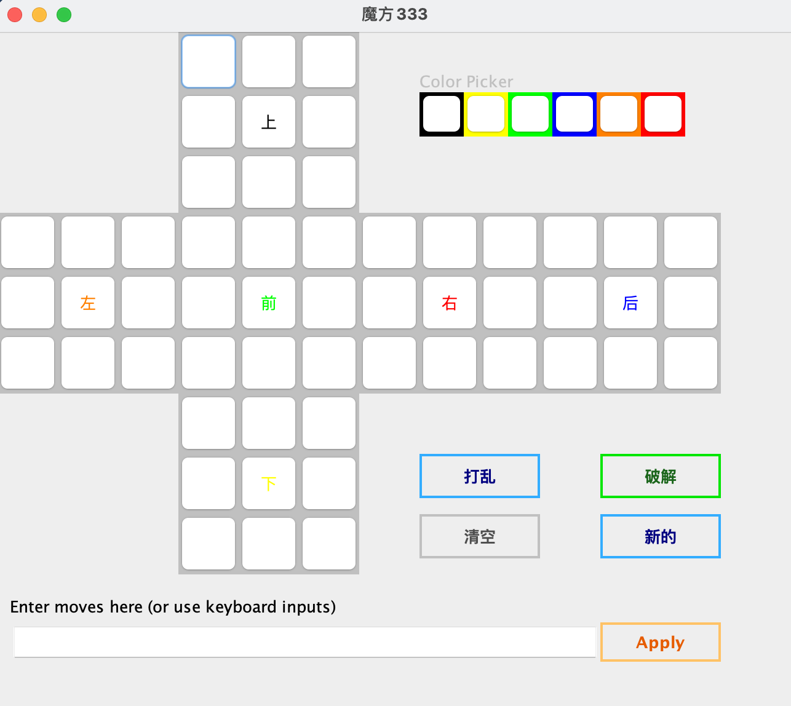
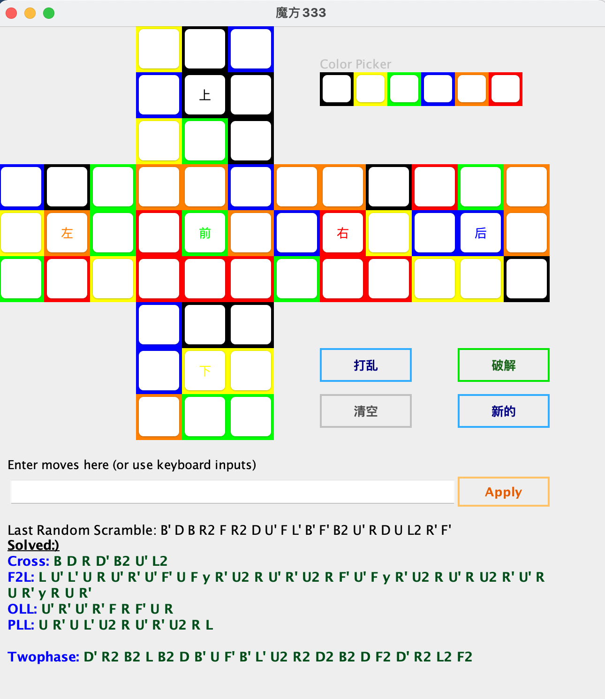

# Cube Solver cubiks2D Restfuapi
Restful
为魔方解码java的springboot api实现示例，可以作为vue示例项目的后端
魔方vue项目地址
[https://gitee.com/taoren/vue-cube](https://gitee.com/taoren/vue-cube)

# Cube Solver cubiks2D JFrame
本窗体解码在原项目基础上做了优化，调整了缓存，部分样式，向原作者致敬
参考项目
[原项目地址 https://github.com/manojbhatt101010/cubiks2D](https://github.com/manojbhatt101010/cubiks2D)

**Download and run CubeSolver.jar to try it out yourself.** (Java 8 or higher required)

(GUI is inspired from Kociemba's[Java package](http://kociemba.org/download.htm) and org.kociemba.twophase package also belongs to him.)

[源码地址 https://gitee.com/taoren/cube-java](https://gitee.com/taoren/cube-java)